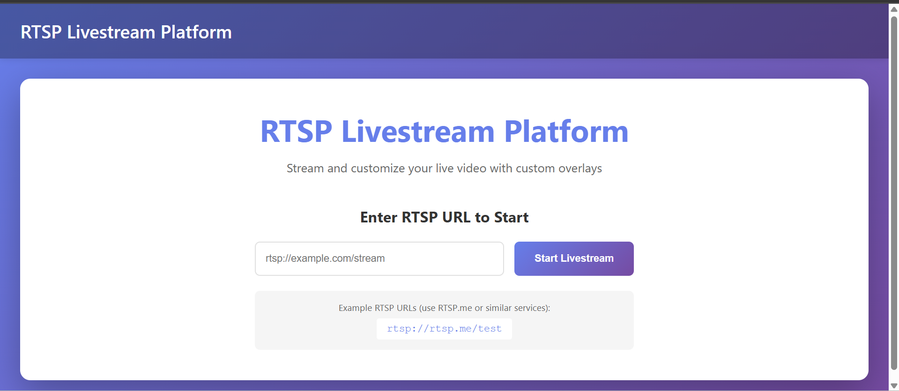
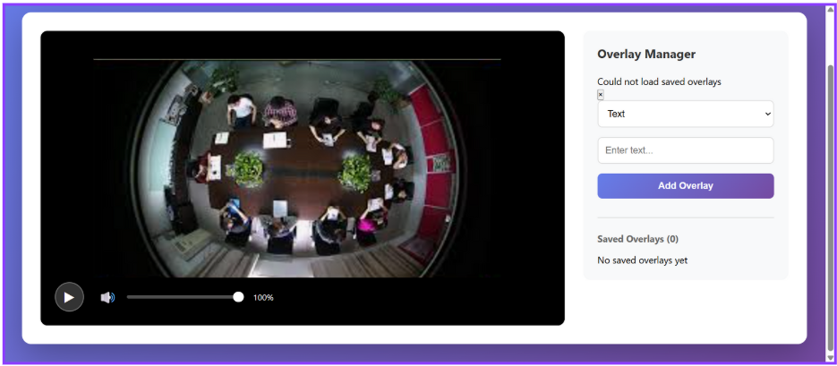

# 🎬 RTSP Livestream Overlay Application

A professional full-stack application for streaming RTSP video with customizable, draggable overlays. Built with Flask, MongoDB, React, and FFmpeg for seamless real-time video streaming with interactive text and image overlays.

---

## ✨ Features

### 🎥 Video Streaming
- **RTSP Support**: Convert any RTSP stream to browser-compatible HLS format
- **Real-time Playback**: Low-latency video streaming with FFmpeg
- **Adaptive Streaming**: Automatic quality adjustment based on network conditions
- **Multiple Stream Support**: Handle various RTSP sources

### 🎨 Overlay Management
- **Custom Overlays**: Add text and image overlays to your livestream
- **Drag & Drop**: Intuitive drag-and-drop interface for overlay positioning
- **Resizable**: Dynamically resize overlays with corner handles
- **Live Updates**: Modify overlays in real-time without interrupting the stream
- **Save & Load**: Full CRUD operations to save and manage overlay configurations

### 🎮 Playback Controls
- **Play/Pause**: Standard video controls
- **Volume Control**: Adjustable volume with visual slider
- **Modern UI**: Beautiful gradient design with smooth animations
- **Responsive**: Works on desktop, tablet, and mobile devices

### 💾 Data Persistence
- **MongoDB Integration**: Store overlay configurations persistently
- **User Profiles**: Optional user-specific overlay management
- **RESTful API**: Complete CRUD API for overlay operations

---

## 📋 Table of Contents

- [Prerequisites](#prerequisites)
- [Quick Start](#quick-start)
- [Project Structure](#project-structure)
- [Installation](#installation)
- [Configuration](#configuration)
- [Usage](#usage)
- [API Documentation](#api-documentation)
- [Deployment](#deployment)
- [Contributing](#contributing)
- [License](#license)
- [Support](#support)

---

## 🔧 Prerequisites

Before you begin, ensure you have the following installed:

| Software | Version | Purpose |
|----------|---------|---------|
| Python | 3.9+ | Backend API |
| Node.js | 16+ | Frontend development |
| MongoDB | 4.4+ | Database |
| FFmpeg | Latest | Video processing |

---

## 🚀 Quick Start

### 1️⃣ Clone the Repository

```bash
git clone https://github.com/yourusername/livestream-overlay-app.git
cd livestream-overlay-app
```

### 2️⃣ Install FFmpeg

**macOS:**
```bash
brew install ffmpeg
```

**Ubuntu/Debian:**
```bash
sudo apt update && sudo apt install ffmpeg
```

**Windows:**
Download from [ffmpeg.org](https://ffmpeg.org/download.html) and add to PATH

### 3️⃣ Start MongoDB

**macOS:**
```bash
brew services start mongodb-community
```

**Linux:**
```bash
sudo systemctl start mongod
```

**Windows:**
```bash
net start MongoDB
```

### 4️⃣ Setup Backend

```bash
cd backend

# Create virtual environment
python -m venv venv
source venv/bin/activate  # Windows: venv\Scripts\activate

# Install dependencies
pip install -r requirements.txt

# Create environment file
cat > .env << EOF
FLASK_APP=run.py
FLASK_ENV=development
MONGO_URI=mongodb://localhost:27017/livestream_db
SECRET_KEY=$(python -c "import secrets; print(secrets.token_hex(32))")
PORT=5000
CORS_ORIGINS=http://localhost:3000
EOF

# Run backend
python run.py
```

✅ Backend running on `http://localhost:5000`

### 5️⃣ Setup Frontend (New Terminal)

```bash
cd frontend

# Install dependencies
npm install

# Create environment file
echo "REACT_APP_API_URL=http://localhost:5000/api" > .env
echo "REACT_APP_STREAM_URL=http://localhost:5000/stream" >> .env

# Start frontend
npm start
```

✅ Frontend running on `http://localhost:3000`

### 6️⃣ Access the Application

Open your browser and navigate to:
```
http://localhost:3000
```

---




## 📁 Project Structure

```
livestream-overlay-app/
│
├── backend/                          # Flask Backend
│   ├── app/
│   │   ├── __init__.py              # Flask app initialization
│   │   ├── config.py                # Configuration management
│   │   ├── models/
│   │   │   ├── __init__.py
│   │   │   └── overlay.py           # Overlay data model
│   │   ├── routes/
│   │   │   ├── __init__.py
│   │   │   ├── overlay_routes.py    # Overlay CRUD endpoints
│   │   │   └── stream_routes.py     # Stream management
│   │   ├── services/
│   │   │   ├── __init__.py
│   │   │   ├── overlay_service.py   # Business logic
│   │   │   └── stream_service.py    # RTSP conversion
│   │   └── utils/
│   │       ├── __init__.py
│   │       └── database.py          # MongoDB utilities
│   ├── streams/                     # HLS output directory
│   ├── requirements.txt             # Python dependencies
│   ├── .env                         # Environment variables
│   ├── run.py                       # Application entry point
│   └── Dockerfile                   # Docker configuration
│
├── frontend/                         # React Frontend
│   ├── public/
│   │   └── index.html               # HTML template
│   ├── src/
│   │   ├── components/
│   │   │   ├── LandingPage.jsx      # Landing page
│   │   │   ├── VideoPlayer.jsx      # Video player
│   │   │   ├── OverlayEditor.jsx    # Overlay manager
│   │   │   ├── OverlayItem.jsx      # Overlay component
│   │   │   └── ControlPanel.jsx     # Playback controls
│   │   ├── services/
│   │   │   └── api.js               # API client
│   │   ├── App.jsx                  # Main component
│   │   ├── App.css                  # Global styles
│   │   ├── index.js                 # React entry point
│   │   └── index.css                # Base styles
│   ├── package.json                 # Node dependencies
│   ├── .env                         # Environment variables
│   └── Dockerfile                   # Docker configuration
│
├── docs/                             # Documentation
│   ├── API_DOCUMENTATION.md         # API reference
│   ├── USER_GUIDE.md                # User manual
│   └── SETUP_GUIDE.md               # Installation guide
│
├── docker-compose.yml                # Docker orchestration
├── .gitignore                        # Git ignore rules
└── README.md                         # This file
```

---

## 💻 Installation